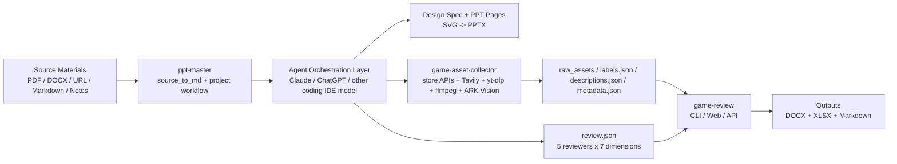
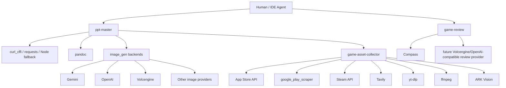

# 三仓协同架构_THREE_REPO_STACK

## 这份文档是干什么的

如果别人想完整复用这套能力，不是只下载一个 `ppt-master` 就结束了，而是至少需要 3 个同级仓库：

1. `ppt-master`：主工作流与 PPT 生成
2. `game-asset-collector`：素材抓取、抽帧、视觉标签
3. `game-review`：评审委员会、结构化打分与报告生成

这份文档回答 4 个问题：

1. 三个仓各自负责什么
2. 模型与第三方 API 分别在哪里被调用
3. 本地应该怎么摆放、怎么串起来跑
4. 整体链路是否完整，以及哪些部分是可选的

---

## 一图看懂



---

## 三个仓分别负责什么

### 1. `ppt-master`

主仓库，负责：

- 源材料转 Markdown
- 项目初始化与内容组织
- 设计规格与页面大纲
- SVG 页面生成
- 原生 PPTX 导出
- 调用 `game-asset-collector` 作为 Step 4.5 的素材采集子流程

它是**入口**，但不是所有子能力都自己实现。

### 2. `game-asset-collector`

素材层能力，负责：

- App Store / Google Play / Steam 商店截图
- YouTube / Bilibili 视频抓取
- `ffmpeg` 抽帧
- pHash 去重
- ARK / Doubao Vision 标签与中文描述

它不负责 PPT，不负责评审，只负责生成可复用的素材证据。

### 3. `game-review`

评审层能力，负责：

- `review.json` 对应的评委会结构
- 5 位评委 × 7 维度打分
- `docx` / `xlsx` / `md` 报告产出
- Web/API 方式的外部游戏评审入口

它默认消费 `game-asset-collector` 的产物。

---

## 模型调用逻辑

### A. 编排层大模型

这一层不是仓库内固定写死的 API，而是**你在 IDE 里实际使用的主模型**：

- 之前：Claude
- 现在：ChatGPT / Codex
- 以后：也可以替换成别的具备长上下文和代码执行能力的模型

它的职责是：

- 读 `SKILL.md`
- 选择调用哪个脚本
- 组织内容、讨论、判断和页面结构
- 产出 `design_spec.md`、PPT 页面内容、`review.json`

也就是说，Claude / ChatGPT 在这里是**工作流编排者**，不是固定绑定在某个 Python 文件里的单点 API。

### B. `ppt-master` 内的直接模型/API

#### 文本与网页转换

- `web_to_md.py`
  - 优先 `curl_cffi`
  - 回退 `requests`
  - 极端场景回退 `web_to_md.cjs`
- `doc_to_md.py`
  - 常见格式走 Python
  - 老格式回退 `pandoc`

这一层主要是**确定性工具链**，不是 LLM。

#### 图像生成

`image_gen.py` 是统一入口，按 `IMAGE_BACKEND` 选择后端，当前支持：

- Gemini
- OpenAI
- Qwen
- Zhipu
- Volcengine
- Stability
- BFL
- Ideogram
- MiniMax
- SiliconFlow
- fal
- Replicate

所以图像生成层是**多后端可插拔**的，不依赖单一厂商。

### C. `game-asset-collector` 内的直接模型/API

#### 抓取器与第三方工具

- App Store iTunes Search / Lookup API
- `google_play_scraper`
- Steam Store API
- Tavily Extract
- `yt-dlp`
- `ffmpeg`

#### 视觉识别

- ARK / Volcengine Vision
- 当前用于截图标签和中文描述生成

这一层是“**确定性抓取 + 轻量视觉模型**”，不负责长文本推理。

### D. `game-review` 内的直接模型/API

当前默认评审 provider：

- Compass API

失败时回退：

- 本地 stub

未来要接火山引擎 API，也应该优先挂在这里，作为 `review.json` 生成器的替代或并行 provider，而不是把评审逻辑散到别的仓里。

---

## 第三方能力清单



---

## 本地目录怎么摆

推荐固定用同级目录：

```text
~/Desktop/Git/
  ppt-master/
  game-asset-collector/
  game-review/
```

这样 3 个仓之间的桥接逻辑可以直接工作，不需要你手动改路径。

---

## 最少怎么串起来用

### 路径 A：只做 PPT

只需要：

- `ppt-master`

适合：

- 报告类 PPT
- 资讯整理
- 不需要外部游戏视觉证据和评审输出的场景

### 路径 B：PPT + 外部游戏素材

需要：

- `ppt-master`
- `game-asset-collector`

适合：

- 竞品参考
- 外部游戏素材版面
- 需要商店截图 / gameplay 视频关键帧的 PPT

### 路径 C：完整闭环

需要全部三个仓：

- `ppt-master`
- `game-asset-collector`
- `game-review`

执行顺序：

1. `ppt-master` 组织需求、项目和页面
2. `game-asset-collector` 拉商店图、视频帧、标签和描述
3. Agent / 人工补全 `review.json`
4. `game-review` 生成 `docx` / `xlsx` / `md`
5. 如需汇报，再回到 `ppt-master` 用报告与证据做最终 PPT

---

## 最推荐的最小命令链

### 1. 抓素材

```bash
cd game-asset-collector
python3 -m venv .venv
source .venv/bin/activate
pip install -e .

python scripts/fetch_game_assets.py "Last Beacon: Survival" \
  --out /ABS/PATH/to/workdir/raw_assets \
  --gplay-id com.hnhs.endlesssea.gp \
  --video 2l4DO5Z10jo \
  --label
```

### 2. 生成评审

```bash
cd game-review
python3 -m venv .venv
source .venv/bin/activate
pip install -e .

game-review review /ABS/PATH/to/workdir --mode external-game --with-visuals
```

### 3. 生成最终 PPT

```bash
cd ppt-master
python3 skills/ppt-master/scripts/project_manager.py init my_project --format ppt169
```

然后让 IDE 里的主模型读取 `skills/ppt-master/SKILL.md`，继续做内容组织和页面生成。

---

## 哪个文件把三仓串起来

有，两层：

### 给人看的

- [`README.md`](../README.md)
- [`生态清单_ECOSYSTEM_MANIFEST.json`](./生态清单_ECOSYSTEM_MANIFEST.json)

### 给程序或 Agent 读的

- `生态清单_ECOSYSTEM_MANIFEST.json`

这个 manifest 明确写了：

- 仓库角色
- 依赖顺序
- 本地目录约定
- 入口文件
- 推荐使用链路
- 关键第三方依赖

---

## 当前结论

如果别人要完整复用，不是下载一个仓，而是要把下面三个都 clone 到本地：

1. `ppt-master`
2. `game-asset-collector`
3. `game-review`

其中：

- `ppt-master` 是主入口
- `game-asset-collector` 是共享素材层
- `game-review` 是共享评审层

这三个仓放在同级目录时，当前链路已经可以闭环。
