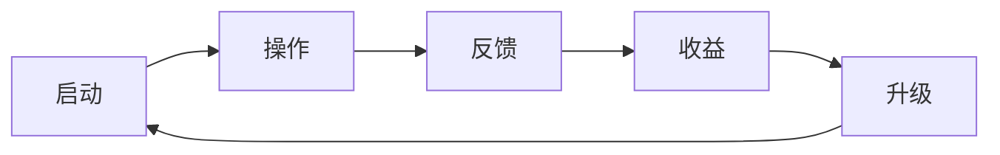

# SRD Table Template — 单循环节奏密度表模板

> 在 `design_spec.md §V` 直接复制本表填写。
> 详细规则见 `${SKILL_DIR}/references/srd-density-checklist.md`。

---

## V.1 SRD 节奏密度表

| 阶段 | 时长 | 玩家行为 | 必触钩子 | 留存目标 | 验收标准 |
|---|---|---|---|---|---|
| **5.1** | 0–30s    | <填动作，动词开头>     | <填钩子，1 个超强> | **95%** | <可观察验收点> |
| **5.2** | 30s–2min | <填>                   | <填，1-2 个>       | **80%** | <可观察验收点> |
| **5.3** | 2–15min  | <填>                   | <填，2-3 个>       | **70%** | <可观察验收点> |
| **5.4** | 15–60min | <填>                   | <填，3-5 个>       | **60%** | <可观察验收点> |
| **5.5** | 1–4h     | <填>                   | <填，4-6 个>       | **50%** | <可观察验收点> |
| **5.6** | **Day 2–3** | <填>                | **<必有 1 个 BIG：战斗/反派/高峰>** | **40%** | <可观察验收点> |
| **5.7** | Day 5–30 | <填>                   | <填，长期 + 赛季>  | **20%** | <可观察验收点> |

---

## V.2 核心循环图解

```
[启动] → [操作] → [反馈] → [收益] → [升级] → [启动]
   ↑                                              |
   └──────────────────────────────────────────────┘
   (单循环时长：~XX 秒)
```

或（更详细）:



---

## V.3 自检清单（写完后必跑）

- [ ] 5.1 起点 ≤30s（不是 30min）
- [ ] 5.2-5.7 时长无断点
- [ ] 5.6 含战斗/反派/第一次高峰（Day 2-3 内）
- [ ] 所有时间字段含单位（s / min / h / Day）
- [ ] 留存目标全部为具体百分数
- [ ] "玩家行为" 字段全部以动词开头
- [ ] "必触钩子" 字段都是设计师能塞进去的具体钩子
- [ ] "验收标准" 字段都是可观察的（如"用户 5s 内完成首次 Tap"）

---

## V.4 反模式自检（写完后再跑一遍）

- [ ] 没有"前期 / 中期 / 后期"模糊词
- [ ] 没有"很快 / 稍后 / 一会儿"模糊词
- [ ] 5.6 没有跳过 Day 2-3
- [ ] 战斗/反派/PvE 没有晚于 Day 3
- [ ] 单循环游戏：5.6 不是"BOSS 战"而是"节日活动 / 突发任务"
- [ ] 塔防/工厂游戏：5.6 必须有"Boss / 危机 / 失败关"

---

## V.5 示例（动物联盟最终版，供参考）

```markdown
| 阶段 | 时长 | 玩家行为 | 必触钩子 | 留存目标 | 验收标准 |
|---|---|---|---|---|---|
| 5.1 | 0–30s | 看到首屏 + 第一只小动物（小狗）走过来 | 主角语音 "欢迎来到动物联盟收容所！" + 1 个 Tap-to-Pet | 95% | 玩家 5s 内完成第一次 Tap |
| 5.2 | 30s–2min | 喂食 + 收到第一笔捐赠 | 数字跳动 + "+10 爱心币" 飘字 | 80% | 玩家 90s 内完成首次喂食 |
| 5.3 | 2–15min | 完整一轮"接收→治疗→升级"循环 | 收容所 lv2 解锁 + 第二种动物（猫）入园 | 70% | 玩家 12min 内完成一次升级 |
| 5.4 | 15–60min | 解锁第二种动物 + 第一名雇员（兽医） | 兽医立绘 + 自动治疗循环启动 | 60% | 玩家 45min 内雇佣兽医 |
| 5.5 | 1–4h | 多动物多雇员系统耦合 + 离线收益 | 离线收益弹窗 "您离开 30min 收到 100 爱心币" | 50% | 玩家次日上线进入第二天 |
| 5.6 | Day 2–3 | **首次偷猎者夜袭** + 救援稀有动物 | 反派出场动画 + Hitman GO 拖拽路径解密玩法 | 40% | 玩家完成首次救援任务 |
| 5.7 | Day 5–30 | 元层进阶（赛季 / 排行榜 / 公会） | 赛季开放 + 联盟入会 + 收集图鉴 | 20% | 玩家形成日常上线习惯 |
```

> 注意 5.6 这一档**特殊**：动物联盟把"战斗"用 Hitman GO 拖拽方式呈现，
> 既不是塔防（重数值）也不是 RPG 战斗（重剧情），是**叙事 + 解密**。
> 这是个**双玩法融合**案例，单循环 pack 一般不需要这么复杂。
